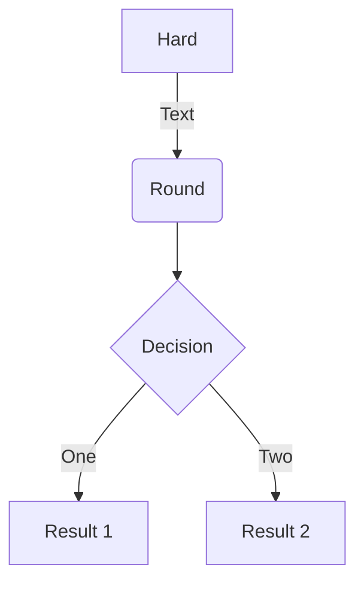

# Superfences
Use `pymdownx.superfences` extension to highlight specific lines:

```{.py3 hl_lines="1 3" linenums="2"}
"""Some file."""
import foo.bar
import boo.baz
import foo.bar.baz
```

See [here](https://facelessuser.github.io/pymdown-extensions/extensions/superfences/) for the details.

# Mermaid
Use `mermaid` plugin to show mermaid diagram:



See [here](https://github.com/fralau/mkdocs-mermaid2-plugin) for details for the setup. Remember to read the part for compatibility with `superfences`.

# Tabbed
Use `pymdownx.tabbed` extension to show examples in different tabs.

=== "Syntax"

    ```bash
    $ besu rlp encode [--from=<FILE>] [--to=<FILE>] [--type=<type>]
    ```

=== "File Example"

    ```bash
    $ besu rlp encode --from=ibft_extra_data.json --to=extra_data_for_ibft_genesis.txt --type=IBFT_EXTRA_DATA
    ```

=== "Standard Input/Output Example"

    ```bash
    $ cat extra_data.json | besu rlp encode > rlp.txt
    ```

See [here](https://facelessuser.github.io/pymdown-extensions/extensions/tabbed/) for the details.

# Details
Use `pymdownx.details` extensions to show collapsable details.
  See [here](https://facelessuser.github.io/pymdown-extensions/extensions/details/) for more details.

???+ note "Open styled details"

    ??? danger "Nested details!"
        And more content again.
